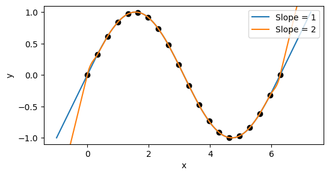

# Cubic Splines

A simple package for interpolating 1D data with Akima cubic splines, based on "A New Method of Interpolation and Smooth Curve Fitting Based on Local Parameters", Akima, 1970.

Works for both uniformly and non-uniformly spaced data points.

## Example usage

### Interpolation

```julia
using PyPlot
using CubicSplines

# spline some sinusoidal data with randomness in the x coordinates
xdata = range(0,stop=4pi,length=20) .+ 0.5rand(20)
ydata = sin.(xdata)
plot(xdata, ydata, "o")

spline = CubicSpline(xdata, ydata)

xs = range(xdata[1], stop=xdata[end], length=1000)
ys = spline[xs]
plot(xs, ys)
xlabel("x")
ylabel("y")
```


### Extrapolation

By default, you will receive an error if you attempt to sample outside of the `xdata` range.
```julia
spline = CubicSpline(xdata, ydata)
# will throw errors:
spline[minimum(xdata) - 0.001]
spline[maximum(xdata) + 0.001]
```


If you want to extrapolate outside of the data range, you can specify the polynomials
to use for this extrapolation (one for each end of the spline).
The left-hand side polynomial coefficients are given as keyword argument `extrapl`, the
right-hand side coefficients as `extrapr` (assuming a x-axis where `-Inf` is on the left
and `+Inf` on the right). For example, if `extrapl` is given, then the left
of the spline will be extrapolated as
```julia
extrapl = [p1, p2, p3, ..., pn]
y = p0 + p1*(x-xdata[1]) + p2*(x-xdata[1])^2 + p3*(x-xdata[1])^3 + ... + pn*(x-xdata[1])^n
```

For example, we can extrapolate from a spline with straight lines of a
specified slope as follows:

```julia
using PyPlot
using CubicSplines

# spline some sinusoidal data
xdata = range(0,stop=2π,length=20)
ydata = sin.(xdata)
plot(xdata, ydata, "ko")

# x values outside of the xdata range
xs = range(-1, stop=2π+1, length=1000)

# extrapolate with linear polynomials of slope=1 or slope=2
for slope in [1,2]
	spline = CubicSpline(xdata, ydata, extrapl=[slope,], extrapr=[slope,])
	plot(xs, spline[xs], label="Slope = $(slope)")
end

xlabel("x")
ylabel("y")
legend()
```



Note that the first and second derivatives of the spline will be matched to the
extrapolating polynomials. Changing the extrapolating polynomials can therefore result
in small changes at the edges of the interpolated region, as we see in the image above.

It is also possible to allow extrapolate on one side of the spline without allowing
extrapolation on the other side of the spline. For example, if we provided a value of
`extrapl` and left `extrapr` as the default value `nothing` then we could extrapolate
to the left of the spline and throw an out of bounds error to the right of the spline.

## Gradient calculation

The gradient of grade `n` at value `x` can be requested by `gradient(spline, x, n)`.
This also works for the extrapolation regions.
