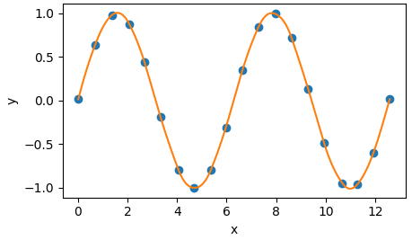

# Cubic Splines

A simple package for interpolating 1D data with Akima cubic splines, based on "A New Method of Interpolation and Smooth Curve Fitting Based on Local Parameters", Akima, 1970.

Works for both uniformly and non-uniformly spaced data points.

## Example usage

```
using PyPlot
using CubicSplines

xdata = range(0,stop=4pi,length=20) .+ 0.5rand(20)
ydata = sin.(xdata)
plot(xdata, ydata, "o")

spline = CubicSpline(xdata, ydata)

xs = range(xdata[1], stop=xdata[end], length=1000)
ys = spline[xs]
plot(xs, ys)
xlabel("x")
ylabel("y")
```

